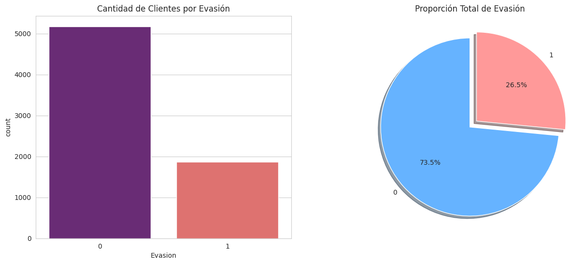
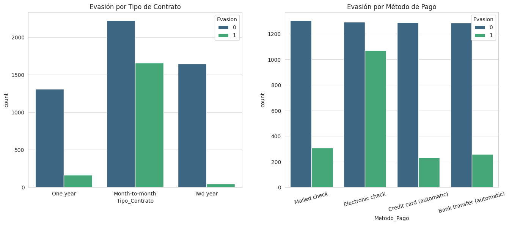
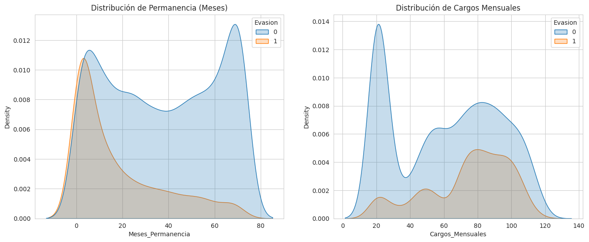

# 📡 Análisis de Evasión de Clientes (Churn) - Telecom X
#### Autor: Victor Asencio

Este repositorio contiene un análisis exhaustivo sobre la pérdida de clientes en la empresa Telecom X, utilizando Python y herramientas de ciencia de datos para identificar patrones críticos y proponer soluciones estratégicas.

## 1. Introducción
El objetivo de este análisis es comprender el fenómeno de la **evasión de clientes (Churn)**. La pérdida de suscriptores es uno de los desafíos más costosos; identificar por qué un cliente cancela permite actuar de forma proactiva, mejorando la retención y optimizando los ingresos a largo plazo.

## 2. Limpieza y Tratamiento de Datos
Se realizaron los siguientes pasos técnicos para asegurar la calidad de los datos:
* **Importación:** Carga de datos desde `TelecomX_Data.json`.
* **Corrección de Tipos:** Conversión de `Cargos_Totales` a numérico (float).
* **Tratamiento de Nulos:** Limpieza de registros sin etiqueta de evasión.
* **Ingeniería de Variables:** Creación de la métrica `Cargos_Diarios`.
* **Traducción:** Estandarización de columnas al español.

## 3. Análisis Exploratorio de Datos (EDA)

### 3.1. Distribución General de la Evasión
El análisis revela que el **26.5%** de los clientes han abandonado la empresa. Es una señal de alerta crítica que requiere una estrategia de fidelización inmediata.

### 3.2. Evasión por Variables Categóricas
* **Contratos:** Los clientes con contrato **Mes a mes** son los más propensos a irse.
* **Pagos:** El método de **Cheque electrónico** presenta la mayor tasa de fuga, sugiriendo que la falta de automatización facilita la cancelación.

### 3.3. Análisis de Variables Numéricas
* **Permanencia:** La fuga es significativamente mayor en los **primeros 12 meses**.
* **Cargos:** Los clientes que se van tienden a tener cargos mensuales más altos (pico entre **$70 y $100**), lo que indica una alta sensibilidad al precio.

## 4. Conclusiones e Insights
1. **Sensibilidad al costo:** Las facturas elevadas son el principal detonante de la evasión.
2. **Periodo Crítico:** Los clientes nuevos son los más volátiles durante su primer año.
3. **Falta de Compromiso:** Los contratos mensuales facilitan la salida rápida de los clientes.

## 5. Recomendaciones Estratégicas
* 🔄 **Migración de Contratos:** Incentivar el paso de contratos mensuales a anuales con descuentos exclusivos.
* ⚠️ **Alertas de Facturación:** Monitorear proactivamente a clientes con cargos superiores a $80.
* 💳 **Automatización de Pagos:** Fomentar el uso de tarjetas o transferencias automáticas.
* 🤝 **Fidelización Temprana:** Programas de satisfacción intensivos durante los primeros 6 meses.

---
## 🚀 Tecnologías Utilizadas
* **Python** (Google Colab)
* **Pandas**: Limpieza y manipulación de datos.
* **Matplotlib & Seaborn**: Visualizaciones estáticas.
* **Plotly**: Gráficos interactivos.
* **JSON/API**: Importación de datos estructurados.
